# Blog Visuals Reference

Mermaid diagrams and hero images for each article. Review these before finalizing the blog posts -- the diagrams can be embedded directly, and hero images can be used for OG/social cards.

---

## Article 1: Comparing macOS Terminal Emulators in 2026

**Hero image:** `hero-terminal-emulators.png`

### Feature Support Scores

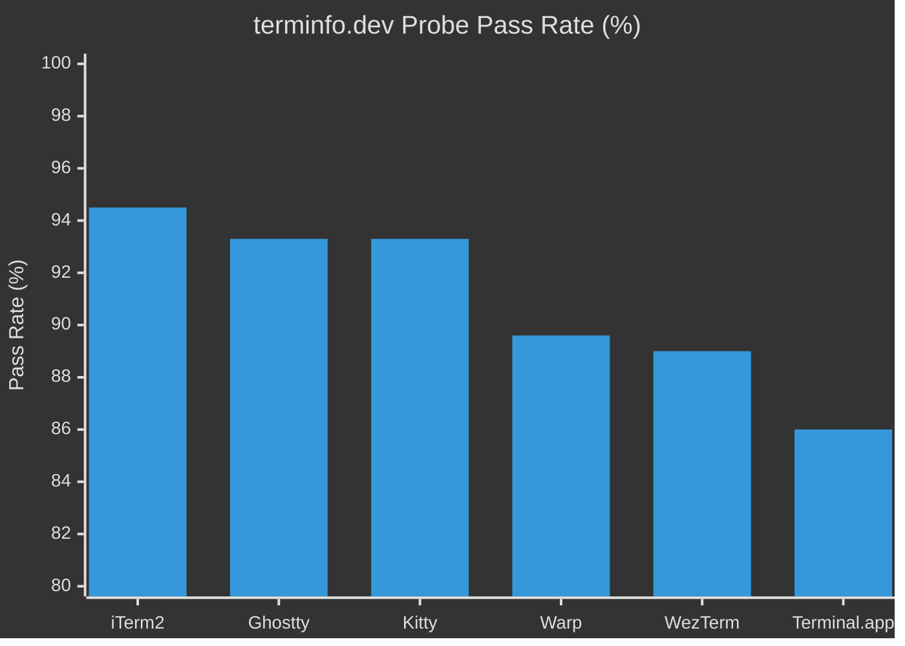

### Protocol Support Matrix

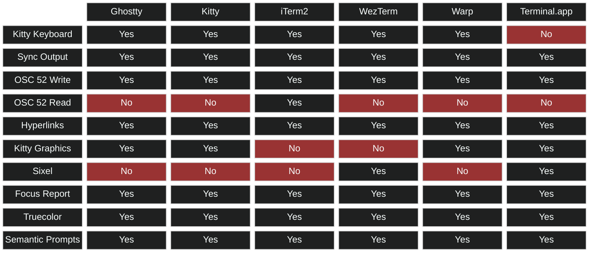

### Rendering Architecture Comparison

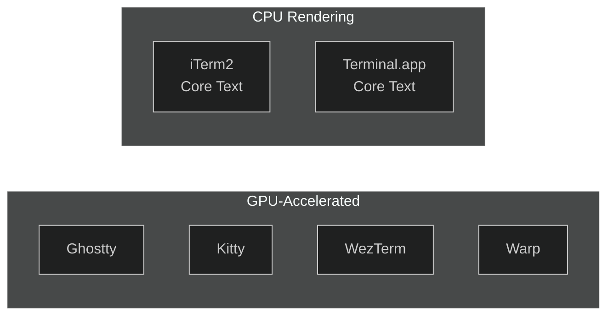

---

## Article 2: Building an AI Coding Agent in the Terminal

**Hero image:** `hero-ai-agent-tui.png`

### Streaming Token Architecture

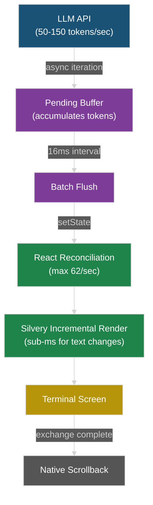

### Three-Zone Scrollback Model

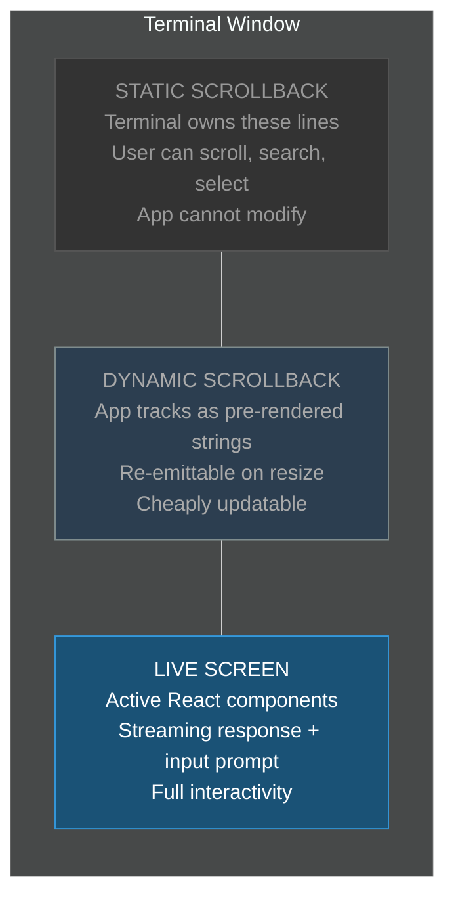

### Tool Call State Machine

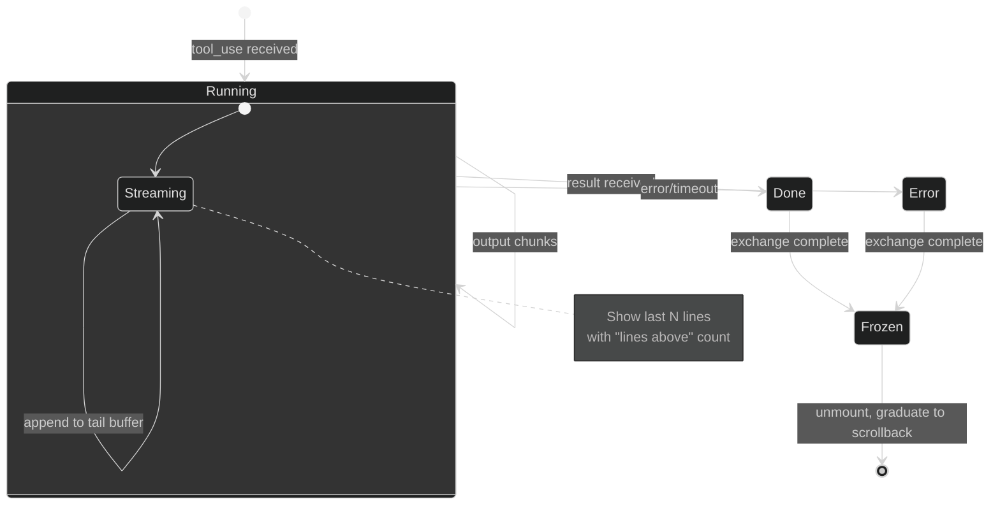

---

## Article 3: Dynamic Scrollback

**Hero image:** `hero-dynamic-scrollback.png`

### Three-Zone Model (Detailed)

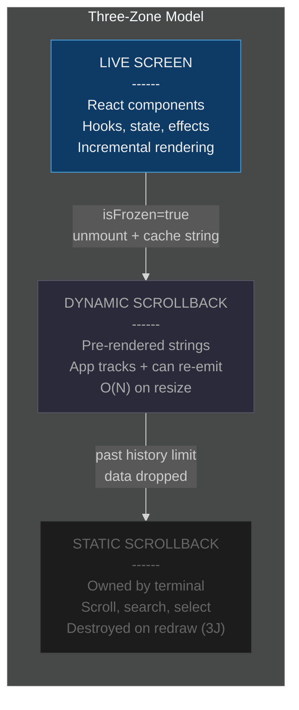

### Item Lifecycle

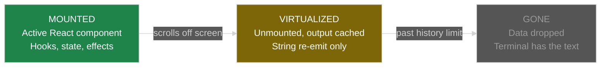

### Alternate Screen vs Dynamic Scrollback

```mermaid
%%{init: {'theme': 'dark'}}%%
graph LR
    subgraph alt["Alternate Screen"]
        direction TB
        A1["App draws everything"]
        A2["Exit = content gone"]
        A3["No native scroll"]
        A4["No Cmd+F search"]
        A5["No text selection across screens"]
    end

    subgraph dyn["Dynamic Scrollback"]
        direction TB
        D1["Live screen + scrollback"]
        D2["Exit = history preserved"]
        D3["Native scroll works"]
        D4["Cmd+F works"]
        D5["Full text selection"]
    end

    alt -.-|"vs"| dyn

    style alt fill:#4a1a1a,color:#ccc,stroke:#833
    style dyn fill:#1a3a1a,color:#ccc,stroke:#3a8
```

---

## Article 4: Terminal Protocols You Should Know in 2026

**Hero image:** `hero-terminal-protocols.png`

### Protocol Adoption Tiers

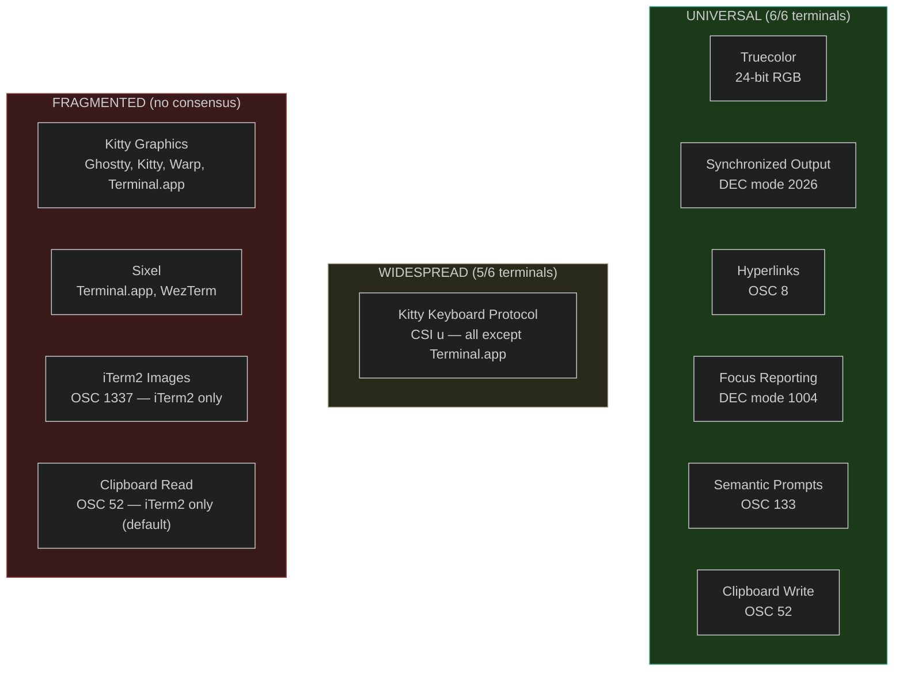

### Graphics Protocol Coverage

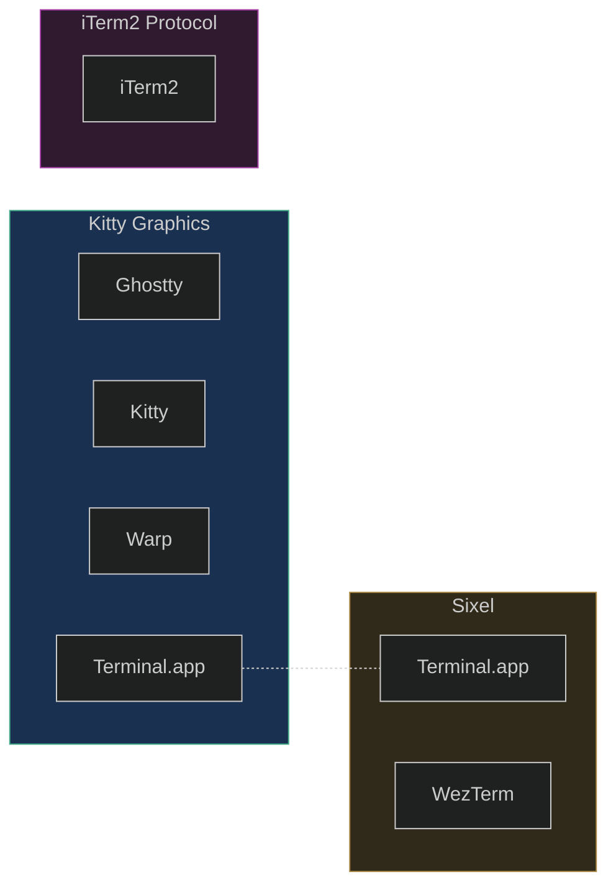

### Synchronized Output Sequence

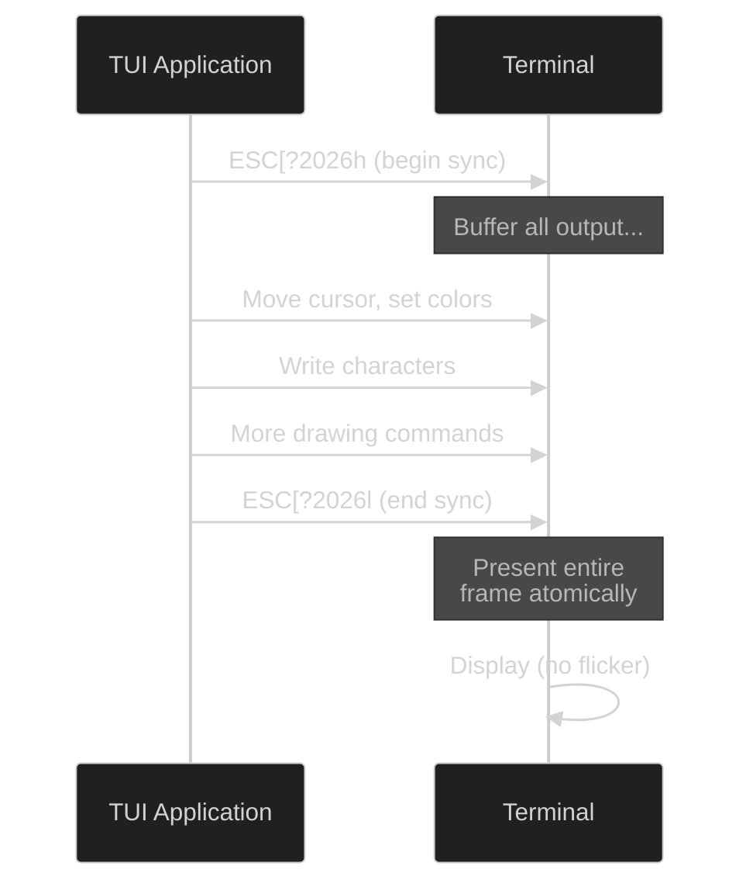

---

## Article 5: Layout-First Rendering

**Hero image:** `hero-layout-first.png`

### Standard vs Silvery Pipeline

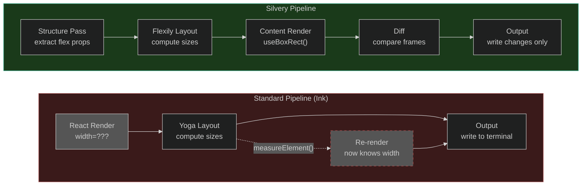

### When useBoxRect() Is Available

```mermaid
%%{init: {'theme': 'dark'}}%%
gantt
    title When Dimensions Are Available
    dateFormat X
    axisFormat %s

    section Ink Pipeline
    React render (width unknown)    :r1, 0, 1
    Yoga layout                     :l1, 1, 2
    Output                          :o1, 2, 3
    measureElement effect fires     :milestone, m1, 3, 0
    Re-render (width known)         :r2, 3, 4
    Re-layout                       :l2, 4, 5
    Re-output                       :o2, 5, 6

    section Silvery Pipeline
    Structure extraction            :s1, 0, 1
    Flexily layout                  :s2, 1, 2
    Content render (width known)    :crit, s3, 2, 3
    Diff + output                   :s4, 3, 4
```

### Structure vs Content Separation

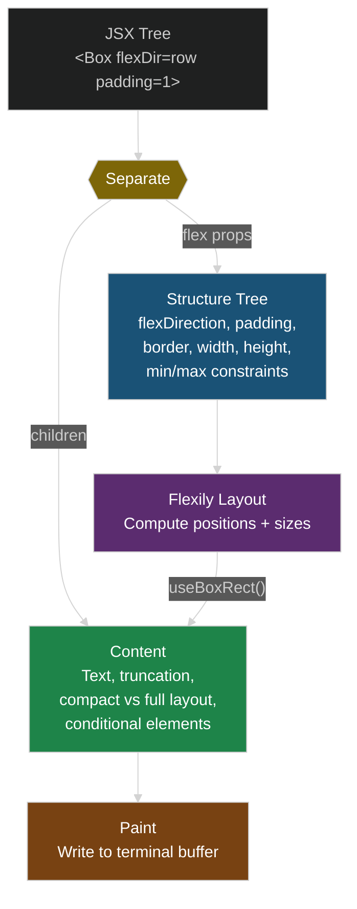

### Responsive Kanban Board

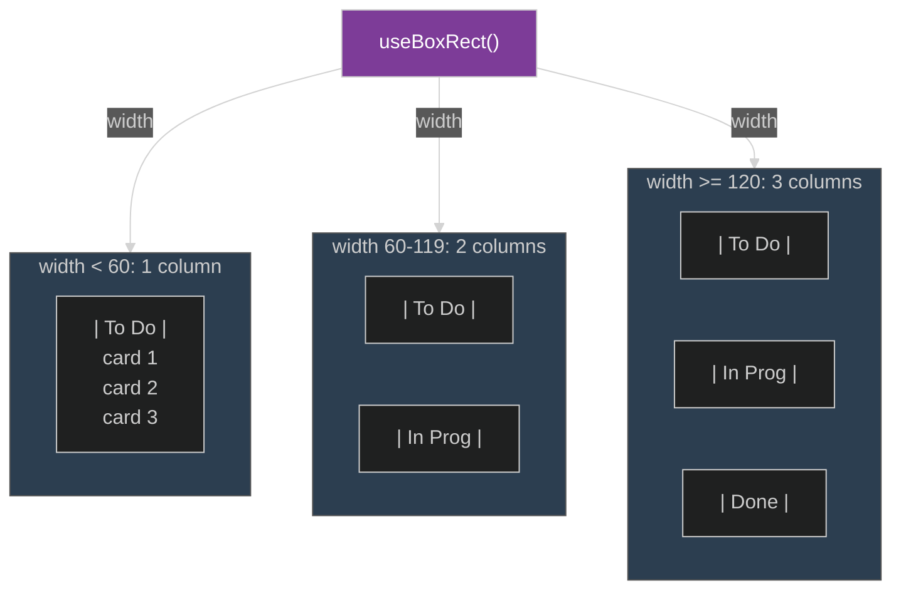

---

## Hero Images

All generated via Gemini 2.5 Flash Image (`gemini-2.5-flash-image` model). Prompts focused on dark, minimal, developer-aesthetic with neon accent colors and no readable text.

| Article            | File                          | Size   |
| ------------------ | ----------------------------- | ------ |
| Terminal Emulators | `hero-terminal-emulators.png` | 1.4 MB |
| AI Agent TUI       | `hero-ai-agent-tui.png`       | 1.5 MB |
| Dynamic Scrollback | `hero-dynamic-scrollback.png` | 1.2 MB |
| Terminal Protocols | `hero-terminal-protocols.png` | 1.6 MB |
| Layout-First       | `hero-layout-first.png`       | 932 KB |

To use as OG images, resize to exactly 1200x630 and compress:

```bash
for f in hero-*.png; do
  convert "$f" -resize 1200x630^ -gravity center -extent 1200x630 -quality 85 "og-${f%.png}.jpg"
done
```
