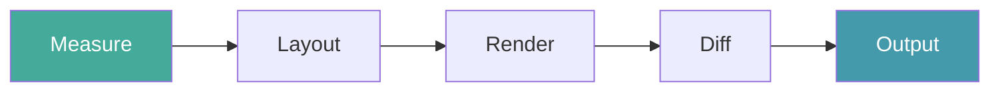
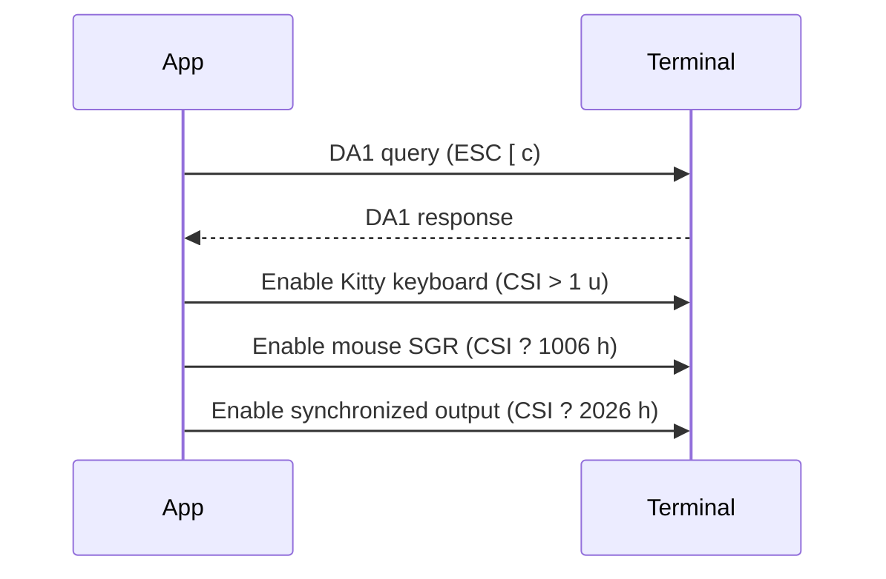
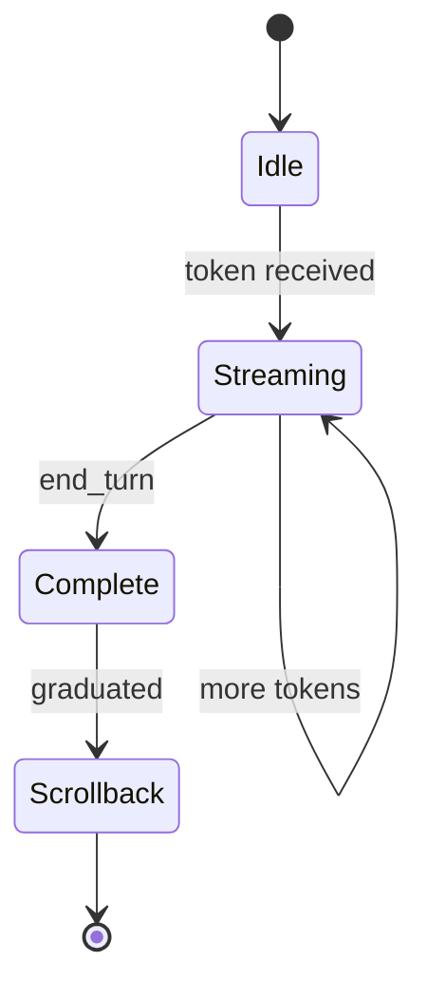
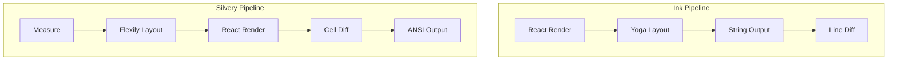
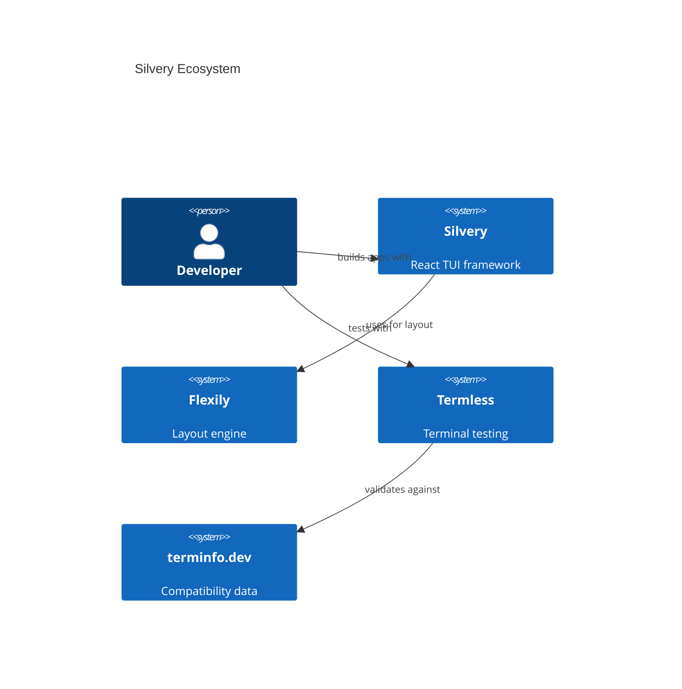

# Content Tools Reference

Last verified: 2026-04-02

## 1. Mermaid — Inline Diagrams

**What:** Render diagrams from text in markdown code blocks. Supports flowcharts, sequence, state, C4, ER, Gantt.

**Setup:** `vitepress-plugin-mermaid` in VitePress config. Wrap export with `withMermaid()`.

**Install:** `bun add -d vitepress-plugin-mermaid mermaid`

### Examples

**Flowchart (rendering pipeline):**

````md

````

**Sequence diagram (terminal protocol negotiation):**

````md

````

**State diagram (component lifecycle):**

````md

````

**Comparison (Silvery vs Ink pipeline):**

````md

````

**C4 architecture:**

````md

````

---

## 2. VHS — Terminal Recordings

**What:** Deterministic terminal GIF/video generation from `.tape` script files.

**Install:** `brew install vhs` or `nix-install nixpkgs#vhs`

**Last verified:** 2026-04-02

### Examples

**Basic demo:**

```tape
# demo.tape
Output demo.gif
Set FontSize 14
Set Width 1200
Set Height 600
Set Theme "Dracula"

Type "bun run app"
Enter
Sleep 2s
Type "j"
Sleep 300ms
Type "j"
Sleep 300ms
Type "j"
Sleep 300ms
Type "k"
Sleep 500ms
Type "q"
```

Run: `vhs demo.tape` → produces `demo.gif`

**Responsive layout demo:**

```tape
Output responsive.gif
Set FontSize 13
Set Width 1400
Set Height 700

Type "bun run app"
Enter
Sleep 2s

# Show wide layout
Sleep 1s

# Resize to narrow
Set Width 600
Sleep 1s

# Resize back
Set Width 1400
Sleep 1s
```

**Theme switching:**

```tape
Output themes.gif
Set FontSize 14
Set Width 1000
Set Height 500

Type "bun run theme --list"
Enter
Sleep 1s
Type "bun run theme --preview dracula"
Enter
Sleep 1s
Type "bun run theme --preview nord"
Enter
Sleep 1s
```

---

## 3. D2 — Architecture Diagrams

**What:** Declarative diagram language. Better than Mermaid for complex architecture. Multiple layout engines.

**Install:** `brew install d2` or `nix-install nixpkgs#d2`

**Last verified:** 2026-04-02

### Examples

**Silvery rendering pipeline:**

```d2
direction: right

measure: Measure {
  shape: rectangle
  style.fill: "#4a9"
}
layout: Flexily Layout
render: React Render {
  style.fill: "#49a"
}
diff: Buffer Diff
output: ANSI Output

measure -> layout -> render -> diff -> output

render.note: |md
  Components have access to
  `useBoxRect()` here
|
```

Run: `d2 pipeline.d2 pipeline.svg`

**Ecosystem map:**

```d2
silvery: Silvery {
  renderer: Renderer
  components: 45+ Components
  theme: Theme Engine
}

flexily: Flexily {
  layout: Flexbox Layout
}

termless: Termless {
  emulator: xterm.js
  matchers: 25 Matchers
}

terminfo: terminfo.dev {
  probes: 164 Probes
  data: 11 Terminals
}

silvery.renderer -> flexily.layout: uses
termless.emulator -> silvery: tests
termless -> terminfo.data: validates against
```

---

## 4. asciinema — Interactive Terminal Player

**What:** Record real terminal sessions. Embeddable web player with scrubbing.

**Install:** `brew install asciinema` or `nix-install nixpkgs#asciinema`

**Last verified:** 2026-04-02

### Recording

```bash
# Record a session
asciinema rec demo.cast

# Record with specific dimensions
asciinema rec --cols 120 --rows 35 demo.cast

# Record with idle time limit (cap pauses at 2s)
asciinema rec --idle-time-limit 2 demo.cast
```

### Embedding in VitePress

Create a Vue component `docs/.vitepress/components/AsciinemaPlayer.vue`:

```vue
<script setup>
import { onMounted, ref } from "vue"
const props = defineProps({ src: String, cols: { default: 80 }, rows: { default: 24 } })
const el = ref()
onMounted(async () => {
  const { create } = await import("asciinema-player")
  create(props.src, el.value, { cols: props.cols, rows: props.rows })
})
</script>
<template><div ref="el" /></template>
```

Use in markdown:

```md
<AsciinemaPlayer src="/recordings/demo.cast" :cols="120" :rows="35" />
```

### Converting to GIF

```bash
# Install agg (asciinema gif generator)
brew install asciinema/tap/agg

# Convert
agg demo.cast demo.gif --cols 120 --rows 35
```

---

## 5. Silicon — Code Snippet Images

**What:** Generate beautiful code images from files or stdin. Like Carbon but CLI-native and instant.

**Install:** `brew install silicon` or `cargo install silicon`

**Last verified:** 2026-04-02

### Examples

```bash
# From file
silicon src/app.tsx -o app.png --theme Dracula

# From stdin with language hint
echo 'const x = useBoxRect()' | silicon -l tsx -o snippet.png

# With specific font and padding
silicon src/app.tsx -o app.png --font "Iosevka" --pad-horiz 40 --pad-vert 30

# No window controls (cleaner for docs)
silicon src/app.tsx -o app.png --no-window-controls
```

---

## 6. Shottr — Screenshot Annotation

**What:** Lightweight macOS screenshot tool with annotation, measurement, and OCR.

**Install:** `brew install --cask shottr`

**Last verified:** 2026-04-02

### Capabilities

- Scrolling capture (full terminal output)
- Bendable arrows and text annotations
- Pixel ruler and measurement
- Blur/redact sensitive areas
- OCR (copy text from screenshots)
- 1.2 MB, M-chip optimized

### Use for

- Before/after terminal screenshots
- Annotating UI with labels ("this column adapts to width")
- Measuring spacing in terminal output
- Redacting private content in screenshots

---

## 7. Gemini — AI Image Generation

**What:** Generate abstract, developer-aesthetic hero images via API.

**Access:** Google AI Studio (free tier: ~500/day) or Vertex AI API

**Last verified:** 2026-04-02

### Example prompts for terminal/developer content

```
"Abstract visualization of a terminal rendering pipeline, dark background,
 neon grid lines, data flowing through stages, minimal and technical,
 no text, 16:9 aspect ratio"

"Minimalist illustration of terminal emulators, dark theme, subtle
 monospace typography texture, abstract geometric shapes suggesting
 code and data flow, professional and clean"

"Dark abstract art of a reactive UI tree with nodes lighting up
 selectively, representing incremental rendering, cyberpunk aesthetic
 but restrained, no text"
```

### Via CLI (using Google AI Studio API key)

```bash
curl -X POST "https://generativelanguage.googleapis.com/v1beta/models/gemini-2.0-flash:generateContent" \
  -H "Content-Type: application/json" \
  -H "x-goog-api-key: $GOOGLE_AI_KEY" \
  -d '{"contents":[{"parts":[{"text":"Generate an image: abstract terminal rendering pipeline, dark background, neon accents"}]}]}'
```

---

## 8. Ideogram — Text-in-Image Generation

**What:** AI image generation with the best text rendering accuracy (~90%).

**Cost:** Free (10/day), Plus $15/month (1000/month)

**Last verified:** 2026-04-02

### Use for

- Blog hero images that include a title or tagline
- OG images with custom text overlays beyond the auto-template
- Code-themed images with readable text

### Example prompts

```
"Blog header image: 'Dynamic Scrollback' text on dark terminal background
 with subtle scroll lines and green monospace text, clean typography,
 1200x630 pixels"

"Developer blog hero: 'Comparing macOS Terminals' text over abstract
 representations of 6 terminal app icons, dark theme, minimal, 1200x630"
```

---

## Tool Decision Matrix

| Need                        | Primary Tool                     | Fallback               |
| --------------------------- | -------------------------------- | ---------------------- |
| Inline diagram in article   | Mermaid (auto-rendered)          | D2 → export SVG        |
| Terminal demo GIF           | VHS (.tape script)               | asciinema → agg        |
| Interactive terminal replay | asciinema player                 | VHS GIF                |
| Architecture diagram        | D2 (complex) or Mermaid (simple) | —                      |
| Code snippet image          | Silicon                          | Carbon (web)           |
| Screenshot annotation       | Shottr                           | CleanShot X            |
| Hero image (abstract)       | Gemini (free)                    | Midjourney (premium)   |
| Image with readable text    | Ideogram ($15/mo)                | Gemini (lower quality) |
| OG preview image            | Auto (VitePress plugin)          | Satori script          |

---

## Maintenance

Re-verify tools quarterly. Check:

- [ ] VitePress plugins still compatible with current VitePress version
- [ ] VHS tape files still produce expected output
- [ ] AI image APIs haven't changed pricing/quality
- [ ] Install commands still work

Next verification due: 2026-07-02
