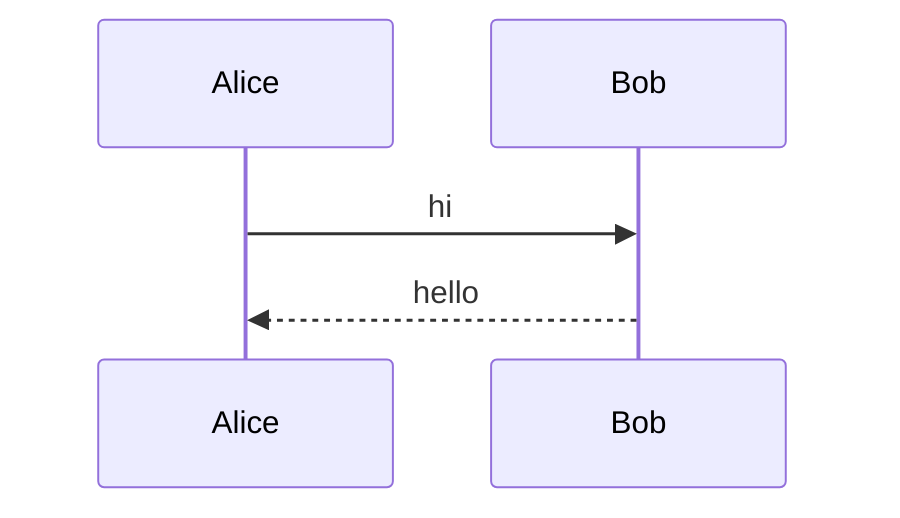
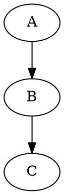
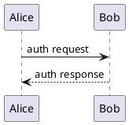

# Exotic language IDs in fenced code blocks

Writers use obscure language hints to drive syntax highlighting in Obsidian,
Foam, Logseq, GitHub, etc. The parser must preserve the _exact_ info-string.



```typescript
import { parseMarkdownToNodes } from "@km/markdown"
const nodes = parseMarkdownToNodes("# hi", "test.md")
```

```dataview
TABLE file.mtime AS "Modified"
FROM #project
SORT file.mtime DESC
```




