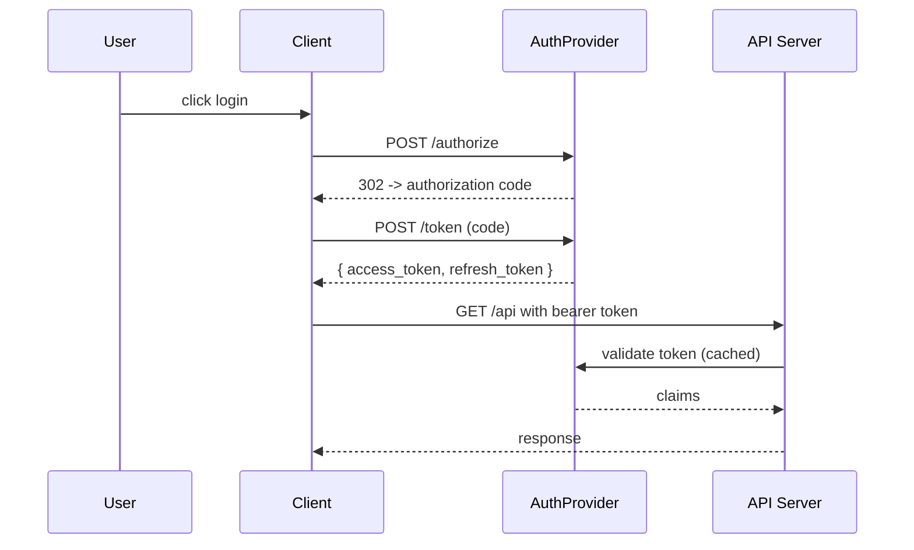

# Q1 2026 Retrospective — Platform Engineering

This is the full retrospective from Q1 2026. It covers the three epics we
committed to, the two we didn't, and the usual surprises in the middle.

## Executive summary

We shipped the storage migration and the auth rewrite on time. The billing
migration slipped one sprint because of a discovery we describe in the
[[Lessons Learned]] section below. Overall velocity was up 18% vs Q4 2025,
driven mostly by the change in [[Decisions/2026-01-15-small-batches]].

Key numbers:

- **PRs merged:** 342 (+14% vs Q4)
- **Incidents:** 4 P1, 11 P2 (vs 8 P1 and 18 P2 in Q4 — big win on incident rate)
- **Code review turnaround:** median 3.2h (vs 5.1h in Q4)
- **Build time:** p50 down from 8m to 4m
- **Bundle size:** web app down 23% after the Rollup migration

See the full dashboard: [[Dashboards/Engineering-Q1-2026]].

## Epic 1: storage migration ^epic-storage

### Goal

Migrate the primary `nodes` table from SQLite to the partitioned Postgres
cluster. The SQLite instance was the last remaining single point of failure
after the [[Decisions/2025-08-ha-baseline]] work.

### What we shipped

```sql
-- Baseline schema on the new cluster
CREATE TABLE nodes (
  id CHAR(26) PRIMARY KEY,   -- ULID
  type VARCHAR(16) NOT NULL,
  parent_id CHAR(26),
  parent_idx INTEGER NOT NULL DEFAULT 0,
  content TEXT,
  created_at BIGINT NOT NULL,
  updated_at BIGINT NOT NULL
) PARTITION BY HASH (id);

CREATE INDEX nodes_parent_idx ON nodes (parent_id, parent_idx);
CREATE INDEX nodes_updated_at_idx ON nodes (updated_at DESC);
```

- [x] Dual-write from the app layer ^task-dual-write
- [x] Backfill job (~48h on the production dataset)
- [x] Read switch-over, feature-flagged
- [x] Retire the SQLite cluster after 2-week soak period
- [x] Remove dual-write logic after retirement

### What went well

- The dual-write pattern we'd used for previous migrations made this boring.
- Splitting the backfill by `created_at` buckets gave us smooth progress
  signals and a clean resume story.
- Feature flags let us roll back reads instantly when we hit the issue
  described in [[Incidents/2026-02-14-read-latency]].

### What didn't

- The initial schema had `type` as `VARCHAR(32)` — we shrank it because
  we know the enum, but that required a rewrite of a backfill pass.
  Should've fixed the enum upfront.
- The feature flag library silently coerced `null` to `false`, which
  caused the [[Incidents/2026-02-14-read-latency]] incident. We patched
  the library in `vendor/flags` and filed the upstream bug.

### Code snippets

The dual-write adapter was a ~200 LOC change. Key piece:

```typescript
export async function writeNode(node: KNode): Promise<void> {
  const sqliteTask = writeSqlite(node)
  const postgresTask = writePostgres(node)
  try {
    await Promise.all([sqliteTask, postgresTask])
  } catch (err) {
    // Log but don't throw — SQLite is still source of truth during migration.
    // Divergence alarm fires from the reconciliation job, not here.
    logger.error("dual-write failed", { id: node.id, err })
    await sqliteTask // Ensure SQLite at least succeeded
  }
}
```

```typescript
// Reconciliation job — runs hourly, checks 10k random nodes.
export async function reconcileSample(sampleSize = 10_000): Promise<Drift> {
  const sample = await sampleSqliteNodes(sampleSize)
  const drifts: Drift[] = []
  for (const sqliteNode of sample) {
    const pgNode = await readPostgres(sqliteNode.id)
    if (!pgNode || hashNode(pgNode) !== hashNode(sqliteNode)) {
      drifts.push({ id: sqliteNode.id, sqlite: sqliteNode, pg: pgNode })
    }
  }
  return drifts
}
```

### Related beads

- [[Beads/km-storage.migrate-to-pg]] — done
- [[Beads/km-storage.retire-sqlite]] — done
- [[Beads/km-storage.dual-write-adapter]] — done

## Epic 2: auth rewrite ^epic-auth

### Goal

Replace the home-grown session layer with the standard OIDC flow. The old
system was from 2019, had a custom cookie jar, and was the source of roughly
30% of our security review findings.

### Approach



### Tasks completed

- [x] Stand up the new OIDC provider (Keycloak, self-hosted)
- [x] Build the client SDK wrapper — `@platform/auth-client`
- [x] Migrate the web app's login flow
- [x] Migrate the mobile apps (iOS, Android)
- [x] Retire the old session layer
- [x] Clean up the 47 references to `cookies.customJar` across the codebase

### Tasks deferred to Q2

- [ ] SCIM provisioning — see [[Beads/km-auth.scim]]
- [ ] Service-to-service auth via client credentials — see [[Beads/km-auth.sv-to-sv]]
- [ ] MFA enforcement policy — waiting on [[Decisions/2026-Q2-mfa-policy]]

### Lessons

> [!note] Lesson: OIDC libraries are inconsistent on refresh
> We evaluated 5 OIDC client libraries. Three of them silently dropped the
> `refresh_token` when the server returned `Cache-Control: no-store`. We
> picked the one that didn't, but wrote a contract test for refresh semantics
> that all future candidates must pass.

> [!warning] Lesson: don't double-encode tokens
> In one sprint we accidentally base64-encoded JWTs before storing in the
> cookie. JWTs are already base64 — the browser happily accepted it, but
> refresh was silently broken for 2 days. Cost: ~40 P3 tickets from users
> saying "I keep getting logged out."

## Epic 3: billing migration ^epic-billing

### Goal

Move the billing subsystem from the legacy PHP stack to the new TypeScript
service, and upgrade from the old flat invoice model to a proper double-entry
ledger.

### What happened

We shipped it one sprint late. Root cause: the PHP system had been silently
rounding to 2 decimal places, but customers' international tax rates had
4-decimal precision. The first migration pass lost cents. We caught it in
the reconciliation pass because we'd built that from day one (see [[Decisions/2025-11-migration-reconciliation]]).

| Sprint | Planned               | Delivered               | Variance  |
| ------ | --------------------- | ----------------------- | --------- |
| S1     | Schema + data model   | Done                    | 0         |
| S2     | Dual-write + backfill | Done, but backfill bugs | -1 sprint |
| S3     | Read switch-over      | Done                    | 0         |
| S4     | Retire legacy         | Done                    | 0         |

### Migration SQL

```sql
-- Old flat invoice model
SELECT invoice_id, customer_id, total, tax FROM invoices
WHERE created_at >= '2023-01-01';

-- New double-entry ledger (simplified)
SELECT
  entry_id,
  invoice_id,
  account,      -- 'receivable', 'revenue', 'tax-payable'
  amount_cents, -- always integer cents in 4-decimal precision (10000 = $1)
  posted_at
FROM ledger_entries
WHERE invoice_id IN (SELECT invoice_id FROM invoices WHERE created_at >= '2023-01-01');
```

### Tasks

- [x] Design the ledger schema
- [x] Port the invoice-generation logic
- [x] Build the reconciliation job
- [x] Fix the precision bug (switched from `DECIMAL(10,2)` to
      `BIGINT` storing 4-decimal cents)
- [x] Retire the PHP billing module

## Epics we didn't finish ^skipped

### Epic 4: events pipeline (deferred to Q2)

We planned to move event ingestion from Kafka to Redpanda. We ran the
evaluation spike but decided against it for Q1 because:

1. Kafka wasn't actually causing problems at our current scale
2. Redpanda's consumer group semantics differ subtly — we'd need to audit
   every consumer
3. We had more urgent work (the auth rewrite was larger than estimated)

See [[Decisions/2026-03-defer-events-pipeline]].

### Epic 5: observability v2 (deferred to Q3)

Full open-telemetry migration. We scoped it, built the prototype, then
realized the [[Decisions/2026-02-observability-prototype]] showed we'd need
to rewrite our custom samplers. Q3 work.

## Incidents ^incidents

### P1 incidents (4)

1. **2026-01-22 — Cache stampede on deploy** — 12 min outage, ~8% of traffic
   errored. Root cause: warm-cache step removed during a refactor. Fix:
   restored warm-cache, added alert on p99 cold-read latency.
2. **2026-02-14 — Read latency post-switchover** — 47 min degraded (p99
   jumped from 120ms to 4s). Root cause: feature flag coerced `null` to
   `false`, disabled the prepared-statement cache. Fix: patched library,
   rolled back, redeployed with explicit flag value.
3. **2026-03-04 — Billing precision bug** — not user-visible, caught by
   reconciliation job. ~$12 of rounding drift across 8k invoices. Fix:
   re-ran backfill with corrected schema.
4. **2026-03-19 — Auth token refresh storm** — 8 min partial outage after
   a deploy. Root cause: new code invalidated _all_ tokens on deploy instead
   of just expired ones. Fix: token versioning logic changed to compare
   token-version-at-issue, not deploy-version.

### P2 incidents (11)

Summarized; full list in [[Incidents/2026-Q1-p2-summary]].

- 3 × flaky CI runs (pre-release gate)
- 2 × Redis memory pressure (fixed by tuning eviction policy)
- 2 × duplicate email sends (idempotency key bug)
- 1 × broken image thumbnails (CDN config drift)
- 1 × search index drift (fixed by reconciliation job)
- 1 × third-party webhook flapping (vendor side, mitigated via retries)
- 1 × log volume overage (cost, not outage — trimmed debug logs)

## Process changes ^process

### What we adopted

- **Small batches**: PRs capped at 400 LOC, merged daily.
  [[Decisions/2026-01-15-small-batches]]
- **Reconciliation-first migrations**: every data migration ships with a
  reconciliation job before the cutover. Caught the billing bug.
- **Incident retrospectives within 48h**: we'd been letting them slide to
  weekly. The quicker cadence caught repeat patterns earlier.

### What we tried and dropped

- **Daily standups** — went back to async after 3 weeks. Engineers found
  them interruptive; async updates in #eng channel were enough.
- **Pairing rotations** — nice in theory but scheduling overhead ate the
  benefit. We kept ad-hoc pairing, dropped the rotation.

### What we deferred

- [ ] Code ownership file — want to do this but need to decide the shape
      first. See [[Beads/km-process.codeowners]].
- [ ] RFC template update — current one is 2 years old. Low priority.

## People notes ^people

Shoutouts:

- [[People/Alice]] for the storage migration's reconciliation job — saved
  us from a production precision bug before customers saw it.
- [[People/Bob]] for the auth rewrite. Massive scope, delivered on time.
- [[People/Mike]] for the observability prototype. Even though we deferred
  the full migration, the prototype validated the approach.

Onboarded:

- [[People/Carol]] — joined in February, shipped her first major PR
  (the CI cache optimization) in March.
- [[People/Dan]] — joined in March, ramping on the storage layer.

## Appendix: decision log ^decisions

All major decisions are linked. Reproduced here for searchability:

- [[Decisions/2026-01-15-small-batches]]
- [[Decisions/2026-01-22-cache-warm-required]]
- [[Decisions/2026-02-observability-prototype]]
- [[Decisions/2026-03-defer-events-pipeline]]
- [[Decisions/2026-03-billing-precision]]
- [[Decisions/2026-Q2-mfa-policy]] (pending)
- [[Decisions/2025-08-ha-baseline]] (prior context)
- [[Decisions/2025-11-migration-reconciliation]] (prior context)

## Appendix: glossary

- **Dual-write**: During migration, the app writes to both the old and new
  stores. Reads are feature-flagged. Enables rollback without data loss.
- **Reconciliation**: Scheduled job comparing source-of-truth and destination
  stores. Surfaces drift before customers do.
- **OIDC**: OpenID Connect — industry-standard auth protocol on top of OAuth 2.
- **P1/P2**: Internal incident severity. P1 = customer-visible, broad impact.
  P2 = customer-visible, narrow impact.

## Appendix: raw data

```json
{
  "quarter": "2026-Q1",
  "prs_merged": 342,
  "incidents": { "p1": 4, "p2": 11, "p3": 62, "p4": 184 },
  "build_time_minutes": { "p50": 4, "p99": 9 },
  "review_turnaround_hours": { "p50": 3.2, "p99": 11.4 },
  "bundle_size_kb": { "web": 1243, "mobile": 892 }
}
```

## Appendix: referenced beads

A selection of beads either closed or re-scoped this quarter:

1. [[Beads/km-storage.migrate-to-pg]] — closed
2. [[Beads/km-storage.retire-sqlite]] — closed
3. [[Beads/km-storage.dual-write-adapter]] — closed
4. [[Beads/km-auth.oidc-cutover]] — closed
5. [[Beads/km-auth.scim]] — re-scoped to Q2
6. [[Beads/km-auth.sv-to-sv]] — re-scoped to Q2
7. [[Beads/km-billing.ledger-port]] — closed
8. [[Beads/km-billing.precision]] — closed (emergency)
9. [[Beads/km-events.redpanda-spike]] — closed (decision: defer)
10. [[Beads/km-obs.otel-prototype]] — closed (prototype)

## End notes

Full dashboard: [[Dashboards/Engineering-Q1-2026]].
Next: [[Planning/2026-Q2]].

<!-- end of retrospective — edit history tracked in git -->
